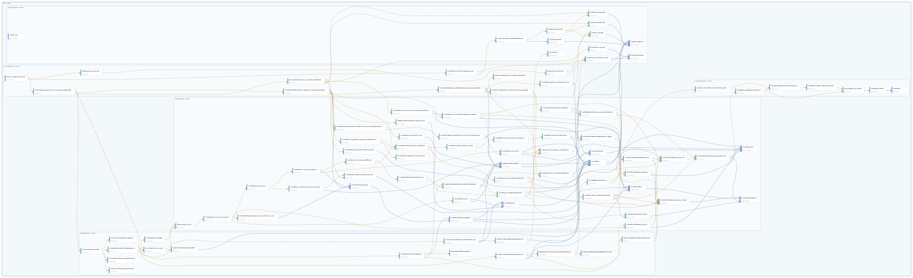

# Complete Declaration Graph

This catalog contains the current committed head of every active public and private declaration. It excludes deleted declarations and revision history.

- Declarations: `96`
- Public: `55`
- Private: `41`

## Dependency graph

The SVG may collapse duplicate Statement/Proof pairs for readability; the JSON document preserves both stage-specific edges.

## Declarations

| Node | Declaration | Visibility | Kind | Status |
| --- | --- | --- | --- | --- |
| `Main.IrreducibleVertex` | [`exists_irreducible_vertex`](declarations/main-irreduciblevertex-exists-irreducible-vertex.md) | `public` | `theorem` | `proved` |
| `Main.IrreducibleVertex` | [`irreducible_vertex_of_weight_eq_one`](declarations/main-irreduciblevertex-irreducible-vertex-of-weight-eq-one.md) | `private` | `lemma` | `proved` |
| `Main.IrreducibleVertex` | [`normalized_pairing_positive_of_unique_underweight`](declarations/main-irreduciblevertex-normalized-pairing-positive-of-unique-underweight.md) | `private` | `lemma` | `proved` |
| `Main.IrreducibleVertex` | [`pairing_decomposition_at_unique_underweight`](declarations/main-irreduciblevertex-pairing-decomposition-at-unique-underweight.md) | `private` | `lemma` | `proved` |
| `Main.IrreducibleVertex` | [`rootedChildCapacitySum_lt_weight_of_unique_underweight`](declarations/main-irreduciblevertex-rootedchildcapacitysum-lt-weight-of-unique-underweight.md) | `private` | `lemma` | `proved` |
| `Main.IrreducibleVertex` | [`rootedChildComponent_isAdmissible_of_unique_underweight`](declarations/main-irreduciblevertex-rootedchildcomponent-isadmissible-of-unique-underweight.md) | `private` | `lemma` | `proved` |
| `Main.IrreducibleVertex` | [`rootedChildComponent_childCount_add_one_eq_degree`](declarations/main-irreduciblevertex-rootedchildcomponent-childcount-add-one-eq-degree.md) | `private` | `lemma` | `proved` |
| `Main.IrreducibleVertex` | [`rootedGram_posDef_of_integer_positive`](declarations/main-irreduciblevertex-rootedgram-posdef-of-integer-positive.md) | `private` | `lemma` | `proved` |
| `Main.IrreducibleVertex` | [`weight_ge_degree_of_ne_unique_underweight`](declarations/main-irreduciblevertex-weight-ge-degree-of-ne-unique-underweight.md) | `private` | `lemma` | `proved` |
| `Main.IrreducibleVertex` | [`weight_ge_two_of_ne_one`](declarations/main-irreduciblevertex-weight-ge-two-of-ne-one.md) | `private` | `lemma` | `proved` |
| `Main.IrreducibleVertex` | [`weight_pos_of_positive`](declarations/main-irreduciblevertex-weight-pos-of-positive.md) | `private` | `lemma` | `proved` |
| `Main.RootedEstimates` | [`root_coefficient_lt_norm`](declarations/main-rootedestimates-root-coefficient-lt-norm.md) | `public` | `theorem` | `proved` |
| `Main.RootedEstimates` | [`rootCoordinateSqLeCapacityMulTreePairing`](declarations/main-rootedestimates-rootcoordinatesqlecapacitymultreepairing.md) | `private` | `theorem` | `proved` |
| `Main.RootedEstimates` | [`rooted_integer_estimate`](declarations/main-rootedestimates-rooted-integer-estimate.md) | `public` | `theorem` | `proved` |
| `Main.RootedEstimates` | [`consecutiveIntegerProductNonneg`](declarations/main-rootedestimates-consecutiveintegerproductnonneg.md) | `private` | `theorem` | `proved` |
| `Main.RootedEstimates` | [`rationalUnitIntervalIntegerDistance`](declarations/main-rootedestimates-rationalunitintervalintegerdistance.md) | `private` | `theorem` | `proved` |
| `Main.RootedEstimates` | [`rootedEstimateInductionAggregation`](declarations/main-rootedestimates-rootedestimateinductionaggregation.md) | `private` | `theorem` | `proved` |
| `Main.RootedEstimates` | [`rootedCapacityInvEqSub`](declarations/main-rootedestimates-rootedcapacityinveqsub.md) | `private` | `theorem` | `proved` |
| `Main.RootedEstimates` | [`rootedChildInductionAbsBound`](declarations/main-rootedestimates-rootedchildinductionabsbound.md) | `private` | `theorem` | `proved` |
| `Main.RootedEstimates` | [`treePairingCastEqRootedGramQuadratic`](declarations/main-rootedestimates-treepairingcasteqrootedgramquadratic.md) | `private` | `theorem` | `proved` |
| `Main.RootedEstimates` | [`treePairingInstanceIndependent`](declarations/main-rootedestimates-treepairinginstanceindependent.md) | `private` | `theorem` | `proved` |
| `Main.RootedEstimates` | [`treePairingRootedChildDecomposition`](declarations/main-rootedestimates-treepairingrootedchilddecomposition.md) | `private` | `theorem` | `proved` |
| `Main.RootedEstimates` | [`sumNeighborContributionRootedChildComponent`](declarations/main-rootedestimates-sumneighborcontributionrootedchildcomponent.md) | `private` | `theorem` | `proved` |
| `Main.RootedEstimates` | [`sumComponentNeighborEqSumAmbientFiltered`](declarations/main-rootedestimates-sumcomponentneighboreqsumambientfiltered.md) | `private` | `theorem` | `proved` |
| `Main.RootedEstimates` | [`sumNonrootEqSumRootedChildComponents`](declarations/main-rootedestimates-sumnonrooteqsumrootedchildcomponents.md) | `private` | `theorem` | `proved` |
| `Main.RootedEstimates` | [`twoBoundsGiveAbsLowerBound`](declarations/main-rootedestimates-twoboundsgiveabslowerbound.md) | `private` | `theorem` | `proved` |
| `Main.RootedEstimates` | [`unitIntervalCompensationNonneg`](declarations/main-rootedestimates-unitintervalcompensationnonneg.md) | `private` | `theorem` | `proved` |
| `Main.RootedCapacity` | [`capacity_pos_lt_one`](declarations/main-rootedcapacity-capacity-pos-lt-one.md) | `public` | `theorem` | `proved` |
| `Main.RootedCapacity` | [`isAdmissibleRootedTree_instance_irrel`](declarations/main-rootedcapacity-isadmissiblerootedtree-instance-irrel.md) | `public` | `theorem` | `proved` |
| `Main.RootedCapacity` | [`rootedCapacity_instance_irrel`](declarations/main-rootedcapacity-rootedcapacity-instance-irrel.md) | `public` | `theorem` | `proved` |
| `Main.RootedCapacity` | [`rootedCapacity_lt_one_of_card_le`](declarations/main-rootedcapacity-rootedcapacity-lt-one-of-card-le.md) | `private` | `theorem` | `proved` |
| `Main.RootedCapacity` | [`rootedCapacity_pos`](declarations/main-rootedcapacity-rootedcapacity-pos.md) | `public` | `theorem` | `proved` |
| `Main.RootedCapacity` | [`rootedCapacity_recursion`](declarations/main-rootedcapacity-rootedcapacity-recursion.md) | `public` | `theorem` | `proved` |
| `Main.RootedCapacity` | [`rootedChildCapacitySum_lt_card_of_forall_lt_one`](declarations/main-rootedcapacity-rootedchildcapacitysum-lt-card-of-forall-lt-one.md) | `private` | `theorem` | `proved` |
| `Main.RootedCapacity` | [`rootedChildComponent_card_lt`](declarations/main-rootedcapacity-rootedchildcomponent-card-lt.md) | `public` | `theorem` | `proved` |
| `Main.RootedCapacity` | [`rootedChildCount_add_one_eq_degree`](declarations/main-rootedcapacity-rootedchildcount-add-one-eq-degree.md) | `public` | `theorem` | `proved` |
| `Main.RootedCapacity` | [`rootedEdgeClassification`](declarations/main-rootedcapacity-rootededgeclassification.md) | `public` | `theorem` | `proved` |
| `Main.RootedCapacity` | [`rootedGram_bilinear_eq_treePairing_cast`](declarations/main-rootedcapacity-rootedgram-bilinear-eq-treepairing-cast.md) | `public` | `theorem` | `proved` |
| `Main.RootedCapacity` | [`rootedGram_rootNonroot_blocks_invertible`](declarations/main-rootedcapacity-rootedgram-rootnonroot-blocks-invertible.md) | `private` | `theorem` | `proved` |
| `Main.RootedCapacity` | [`rootedGram_reindex_rootNonroot_blocks`](declarations/main-rootedcapacity-rootedgram-reindex-rootnonroot-blocks.md) | `public` | `theorem` | `proved` |
| `Main.RootedCapacity` | [`rootedGram_root_nonroot_linear_eq_sum_childRoots`](declarations/main-rootedcapacity-rootedgram-root-nonroot-linear-eq-sum-childroots.md) | `public` | `theorem` | `proved` |
| `Main.RootedCapacity` | [`rootedGram_root_rootedChildComponent_support`](declarations/main-rootedcapacity-rootedgram-root-rootedchildcomponent-support.md) | `public` | `theorem` | `proved` |
| `Main.RootedCapacity` | [`rootedNeighborFinset_eq_insert_predecessor`](declarations/main-rootedcapacity-rootedneighborfinset-eq-insert-predecessor.md) | `private` | `theorem` | `proved` |
| `Main.RootedCapacity` | [`rootedChildComponent_adj_mem`](declarations/main-rootedcapacity-rootedchildcomponent-adj-mem.md) | `private` | `theorem` | `proved` |
| `Main.RootedCapacity` | [`rootedNonrootGram_reindex_childBlocks_inv_of_child_admissible`](declarations/main-rootedcapacity-rootednonrootgram-reindex-childblocks-inv-of-child-admissible.md) | `public` | `theorem` | `proved` |
| `Main.RootedCapacity` | [`rootedChildGram_blockDiagonal_inv_of_child_admissible`](declarations/main-rootedcapacity-rootedchildgram-blockdiagonal-inv-of-child-admissible.md) | `public` | `theorem` | `proved` |
| `Main.RootedCapacity` | [`rootedNonroot_inverse_quadratic`](declarations/main-rootedcapacity-rootednonroot-inverse-quadratic.md) | `private` | `theorem` | `proved` |
| `Main.RootedCapacity` | [`rootedChildCapacitySum`](declarations/main-rootedcapacity-rootedchildcapacitysum.md) | `public` | `definition` | `declared` |
| `Main.RootedCapacity` | [`rootedChildCapacitySummand`](declarations/main-rootedcapacity-rootedchildcapacitysummand.md) | `public` | `definition` | `declared` |
| `Main.RootedCapacity` | [`rootedCapacity`](declarations/main-rootedcapacity-rootedcapacity.md) | `public` | `definition` | `declared` |
| `Main.RootedCapacity` | [`rootedGram_root_nonroot`](declarations/main-rootedcapacity-rootedgram-root-nonroot.md) | `private` | `theorem` | `proved` |
| `Main.RootedCapacity` | [`rootedNonroot_inverse_childBlocks`](declarations/main-rootedcapacity-rootednonroot-inverse-childblocks.md) | `private` | `theorem` | `proved` |
| `Main.RootedCapacity` | [`rootedChildGram_blockDiagonal_inv`](declarations/main-rootedcapacity-rootedchildgram-blockdiagonal-inv.md) | `private` | `theorem` | `proved` |
| `Main.RootedCapacity` | [`IsAdmissibleRootedTree_rootedChildComponent`](declarations/main-rootedcapacity-isadmissiblerootedtree-rootedchildcomponent.md) | `public` | `theorem` | `proved` |
| `Main.RootedCapacity` | [`IsAdmissibleRootedTree`](declarations/main-rootedcapacity-isadmissiblerootedtree.md) | `public` | `definition` | `declared` |
| `Main.RootedCapacity` | [`rootedChildCount_rootedChildComponent`](declarations/main-rootedcapacity-rootedchildcount-rootedchildcomponent.md) | `public` | `theorem` | `proved` |
| `Main.RootedCapacity` | [`rootedChildCount`](declarations/main-rootedcapacity-rootedchildcount.md) | `public` | `definition` | `declared` |
| `Main.RootedCapacity` | [`rootedChildren_rootedChildComponent`](declarations/main-rootedcapacity-rootedchildren-rootedchildcomponent.md) | `public` | `theorem` | `proved` |
| `Main.RootedCapacity` | [`rootedChildRoot`](declarations/main-rootedcapacity-rootedchildroot.md) | `public` | `definition` | `declared` |
| `Main.RootedCapacity` | [`rootedNonroot_quadratic_eq_sum_childQuadratics`](declarations/main-rootedcapacity-rootednonroot-quadratic-eq-sum-childquadratics.md) | `public` | `theorem` | `proved` |
| `Main.RootedCapacity` | [`blockDiagonal_quadratic_eq_sum_blocks`](declarations/main-rootedcapacity-blockdiagonal-quadratic-eq-sum-blocks.md) | `private` | `theorem` | `proved` |
| `Main.RootedCapacity` | [`rootedNonrootGram_reindex_childBlocks`](declarations/main-rootedcapacity-rootednonrootgram-reindex-childblocks.md) | `public` | `theorem` | `proved` |
| `Main.RootedCapacity` | [`rootedGram_cross_rootedChildComponents`](declarations/main-rootedcapacity-rootedgram-cross-rootedchildcomponents.md) | `private` | `theorem` | `proved` |
| `Main.RootedCapacity` | [`rootedGram_rootedChildComponent`](declarations/main-rootedcapacity-rootedgram-rootedchildcomponent.md) | `public` | `theorem` | `proved` |
| `Main.RootedCapacity` | [`rootedChildComponent_isTree`](declarations/main-rootedcapacity-rootedchildcomponent-istree.md) | `public` | `theorem` | `proved` |
| `Main.RootedCapacity` | [`rootedNonrootGram_submatrix_entry`](declarations/main-rootedcapacity-rootednonrootgram-submatrix-entry.md) | `private` | `theorem` | `proved` |
| `Main.RootedCapacity` | [`rootedNonrootGram_reindex_entry_explicit`](declarations/main-rootedcapacity-rootednonrootgram-reindex-entry-explicit.md) | `private` | `theorem` | `proved` |
| `Main.RootedCapacity` | [`rootedNonrootGram_reindex_entry`](declarations/main-rootedcapacity-rootednonrootgram-reindex-entry.md) | `private` | `theorem` | `proved` |
| `Main.RootedCapacity` | [`rootedChildComponentsEquivNonroot_apply`](declarations/main-rootedcapacity-rootedchildcomponentsequivnonroot-apply.md) | `public` | `theorem` | `proved` |
| `Main.RootedCapacity` | [`rootedChildComponentsEquivNonroot`](declarations/main-rootedcapacity-rootedchildcomponentsequivnonroot.md) | `public` | `definition` | `declared` |
| `Main.RootedCapacity` | [`rootedChildComponent_parent_not_mem`](declarations/main-rootedcapacity-rootedchildcomponent-parent-not-mem.md) | `public` | `theorem` | `proved` |
| `Main.RootedCapacity` | [`rootedChildComponent_partition`](declarations/main-rootedcapacity-rootedchildcomponent-partition.md) | `public` | `theorem` | `proved` |
| `Main.RootedCapacity` | [`rootedChildComponent_path_decomposition`](declarations/main-rootedcapacity-rootedchildcomponent-path-decomposition.md) | `public` | `theorem` | `proved` |
| `Main.RootedCapacity` | [`rootedChildComponent`](declarations/main-rootedcapacity-rootedchildcomponent.md) | `public` | `definition` | `declared` |
| `Main.RootedCapacity` | [`rootedChildren`](declarations/main-rootedcapacity-rootedchildren.md) | `public` | `definition` | `declared` |
| `Main.RootedCapacity` | [`rootedGram`](declarations/main-rootedcapacity-rootedgram.md) | `public` | `definition` | `declared` |
| `Main.RootedCapacity` | [`treePairing_vertexVector_vertexVector`](declarations/main-rootedcapacity-treepairing-vertexvector-vertexvector.md) | `public` | `theorem` | `proved` |
| `Main.LatticeFoundations` | [`irreducibleOfPairingSelfEqOneAnchor`](declarations/main-latticefoundations-irreducibleofpairingselfeqoneanchor.md) | `public` | `theorem` | `proved` |
| `Main.LatticeFoundations` | [`IrreducibleAnchor`](declarations/main-latticefoundations-irreducibleanchor.md) | `public` | `definition` | `declared` |
| `Main.LatticeFoundations` | [`treePairing`](declarations/main-latticefoundations-treepairing.md) | `public` | `definition` | `declared` |
| `Main.LatticeFoundations` | [`treePairing_add_self`](declarations/main-latticefoundations-treepairing-add-self.md) | `public` | `theorem` | `proved` |
| `Main.LatticeFoundations` | [`treePairing_add_left`](declarations/main-latticefoundations-treepairing-add-left.md) | `public` | `theorem` | `proved` |
| `Main.LatticeFoundations` | [`treePairing_add_right`](declarations/main-latticefoundations-treepairing-add-right.md) | `public` | `theorem` | `proved` |
| `Main.LatticeFoundations` | [`treePairing_symm`](declarations/main-latticefoundations-treepairing-symm.md) | `public` | `theorem` | `proved` |
| `Main.LatticeFoundations` | [`treePairing_vertexVector_self`](declarations/main-latticefoundations-treepairing-vertexvector-self.md) | `public` | `theorem` | `proved` |
| `Main.LatticeFoundations` | [`treePairingAnchor`](declarations/main-latticefoundations-treepairinganchor.md) | `public` | `definition` | `declared` |
| `Main.LatticeFoundations` | [`vertexVector`](declarations/main-latticefoundations-vertexvector.md) | `public` | `definition` | `declared` |
| `Main.LatticeFoundations` | [`vertexVector_ne_zero`](declarations/main-latticefoundations-vertexvector-ne-zero.md) | `public` | `theorem` | `proved` |
| `Main.LatticeFoundations` | [`vertexVectorAnchor`](declarations/main-latticefoundations-vertexvectoranchor.md) | `public` | `definition` | `declared` |
| `Main.TreePathSeparation` | [`reachable_childSide_of_uniquePath_concat`](declarations/main-treepathseparation-reachable-childside-of-uniquepath-concat.md) | `public` | `theorem` | `proved` |
| `Main.TreePathSeparation` | [`uniquePath_eq_append_through_cut`](declarations/main-treepathseparation-uniquepath-eq-append-through-cut.md) | `public` | `theorem` | `proved` |
| `Main.TreePathSeparation` | [`uniquePath_append_isPath_through_cut`](declarations/main-treepathseparation-uniquepath-append-ispath-through-cut.md) | `private` | `theorem` | `proved` |
| `Main.TreePathSeparation` | [`uniquePath_support_separated_by_cut`](declarations/main-treepathseparation-uniquepath-support-separated-by-cut.md) | `public` | `theorem` | `proved` |
| `Main.TreePathSeparation` | [`eq_uniquePath_of_isPath`](declarations/main-treepathseparation-eq-uniquepath-of-ispath.md) | `private` | `theorem` | `proved` |
| `Main.TreePathSeparation` | [`uniquePath_isPath`](declarations/main-treepathseparation-uniquepath-ispath.md) | `private` | `theorem` | `proved` |
| `Main.TreePathSeparation` | [`uniquePath`](declarations/main-treepathseparation-uniquepath.md) | `public` | `def` | `declared` |
