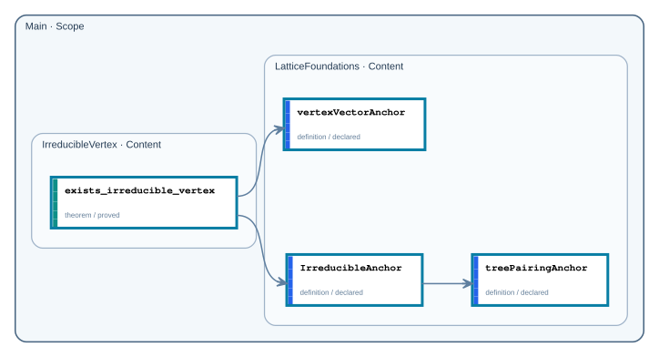

# Public API

- Repository completion: `graph_proved`
- Proof availability: `proved`
- Public declarations: `4` across `2` nodes

## Dependency graph

Arrows run from each consumer to the public declarations it depends on. Solid arrows are Statement dependencies; dashed arrows are Proof dependencies. Transitively implied edges are omitted for readability; each declaration page lists the complete direct dependency set. Mathlib and non-public project dependencies are not shown.

## Declarations

| Node | Declaration | Kind | Status |
| --- | --- | --- | --- |
| `Main.IrreducibleVertex` | [`exists_irreducible_vertex`](declarations/main-irreduciblevertex-exists-irreducible-vertex.md) | `theorem` | `proved` |
| `Main.LatticeFoundations` | [`IrreducibleAnchor`](declarations/main-latticefoundations-irreducibleanchor.md) | `definition` | `declared` |
| `Main.LatticeFoundations` | [`treePairingAnchor`](declarations/main-latticefoundations-treepairinganchor.md) | `definition` | `declared` |
| `Main.LatticeFoundations` | [`vertexVectorAnchor`](declarations/main-latticefoundations-vertexvectoranchor.md) | `definition` | `declared` |
