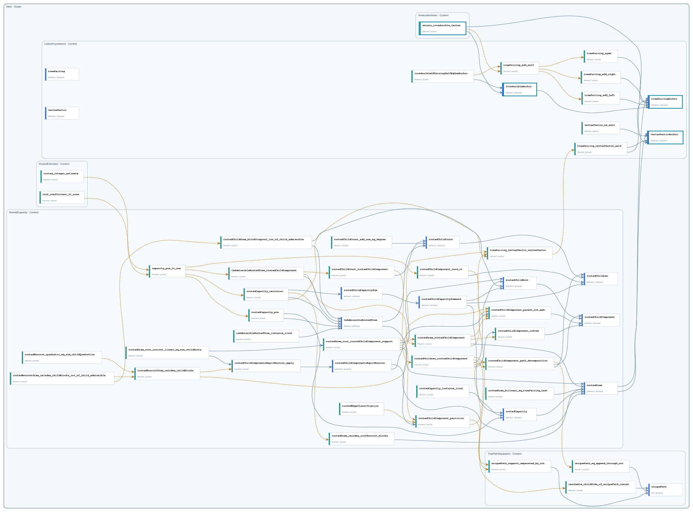

# Public Boundaries

This catalog shows every Content-public declaration and how it is selectively propagated through Scope boundaries. Only declarations exported through `Main` belong to the repository Public API.

- Content-public declarations: `55`
- Main exports: `4`

## Boundary graph

Solid gray arrows are Statement dependencies; dashed amber arrows are Proof dependencies. A thick teal declaration frame marks a Main export; compact upward labels record intermediate Scope exports.

## Declarations

| Node | Declaration | Kind | Status | Exported through | Main API |
| --- | --- | --- | --- | --- | --- |
| `Main.IrreducibleVertex` | [`exists_irreducible_vertex`](declarations/main-irreduciblevertex-exists-irreducible-vertex.md) | `theorem` | `proved` | `Main` | yes |
| `Main.RootedEstimates` | [`root_coefficient_lt_norm`](declarations/main-rootedestimates-root-coefficient-lt-norm.md) | `theorem` | `proved` | — | no |
| `Main.RootedEstimates` | [`rooted_integer_estimate`](declarations/main-rootedestimates-rooted-integer-estimate.md) | `theorem` | `proved` | — | no |
| `Main.RootedCapacity` | [`capacity_pos_lt_one`](declarations/main-rootedcapacity-capacity-pos-lt-one.md) | `theorem` | `proved` | — | no |
| `Main.RootedCapacity` | [`IsAdmissibleRootedTree_rootedChildComponent`](declarations/main-rootedcapacity-isadmissiblerootedtree-rootedchildcomponent.md) | `theorem` | `proved` | — | no |
| `Main.RootedCapacity` | [`isAdmissibleRootedTree_instance_irrel`](declarations/main-rootedcapacity-isadmissiblerootedtree-instance-irrel.md) | `theorem` | `proved` | — | no |
| `Main.RootedCapacity` | [`rootedCapacity_instance_irrel`](declarations/main-rootedcapacity-rootedcapacity-instance-irrel.md) | `theorem` | `proved` | — | no |
| `Main.RootedCapacity` | [`rootedCapacity_pos`](declarations/main-rootedcapacity-rootedcapacity-pos.md) | `theorem` | `proved` | — | no |
| `Main.RootedCapacity` | [`rootedCapacity_recursion`](declarations/main-rootedcapacity-rootedcapacity-recursion.md) | `theorem` | `proved` | — | no |
| `Main.RootedCapacity` | [`rootedChildCapacitySum`](declarations/main-rootedcapacity-rootedchildcapacitysum.md) | `definition` | `declared` | — | no |
| `Main.RootedCapacity` | [`rootedChildCapacitySummand`](declarations/main-rootedcapacity-rootedchildcapacitysummand.md) | `definition` | `declared` | — | no |
| `Main.RootedCapacity` | [`rootedCapacity`](declarations/main-rootedcapacity-rootedcapacity.md) | `definition` | `declared` | — | no |
| `Main.RootedCapacity` | [`rootedChildComponent_card_lt`](declarations/main-rootedcapacity-rootedchildcomponent-card-lt.md) | `theorem` | `proved` | — | no |
| `Main.RootedCapacity` | [`rootedChildCount_add_one_eq_degree`](declarations/main-rootedcapacity-rootedchildcount-add-one-eq-degree.md) | `theorem` | `proved` | — | no |
| `Main.RootedCapacity` | [`rootedChildCount_rootedChildComponent`](declarations/main-rootedcapacity-rootedchildcount-rootedchildcomponent.md) | `theorem` | `proved` | — | no |
| `Main.RootedCapacity` | [`rootedChildren_rootedChildComponent`](declarations/main-rootedcapacity-rootedchildren-rootedchildcomponent.md) | `theorem` | `proved` | — | no |
| `Main.RootedCapacity` | [`rootedEdgeClassification`](declarations/main-rootedcapacity-rootededgeclassification.md) | `theorem` | `proved` | — | no |
| `Main.RootedCapacity` | [`rootedGram_bilinear_eq_treePairing_cast`](declarations/main-rootedcapacity-rootedgram-bilinear-eq-treepairing-cast.md) | `theorem` | `proved` | — | no |
| `Main.RootedCapacity` | [`rootedGram_reindex_rootNonroot_blocks`](declarations/main-rootedcapacity-rootedgram-reindex-rootnonroot-blocks.md) | `theorem` | `proved` | — | no |
| `Main.RootedCapacity` | [`rootedGram_root_nonroot_linear_eq_sum_childRoots`](declarations/main-rootedcapacity-rootedgram-root-nonroot-linear-eq-sum-childroots.md) | `theorem` | `proved` | — | no |
| `Main.RootedCapacity` | [`rootedGram_root_rootedChildComponent_support`](declarations/main-rootedcapacity-rootedgram-root-rootedchildcomponent-support.md) | `theorem` | `proved` | — | no |
| `Main.RootedCapacity` | [`rootedNonrootGram_reindex_childBlocks_inv_of_child_admissible`](declarations/main-rootedcapacity-rootednonrootgram-reindex-childblocks-inv-of-child-admissible.md) | `theorem` | `proved` | — | no |
| `Main.RootedCapacity` | [`rootedChildGram_blockDiagonal_inv_of_child_admissible`](declarations/main-rootedcapacity-rootedchildgram-blockdiagonal-inv-of-child-admissible.md) | `theorem` | `proved` | — | no |
| `Main.RootedCapacity` | [`IsAdmissibleRootedTree`](declarations/main-rootedcapacity-isadmissiblerootedtree.md) | `definition` | `declared` | — | no |
| `Main.RootedCapacity` | [`rootedChildCount`](declarations/main-rootedcapacity-rootedchildcount.md) | `definition` | `declared` | — | no |
| `Main.RootedCapacity` | [`rootedChildRoot`](declarations/main-rootedcapacity-rootedchildroot.md) | `definition` | `declared` | — | no |
| `Main.RootedCapacity` | [`rootedNonroot_quadratic_eq_sum_childQuadratics`](declarations/main-rootedcapacity-rootednonroot-quadratic-eq-sum-childquadratics.md) | `theorem` | `proved` | — | no |
| `Main.RootedCapacity` | [`rootedNonrootGram_reindex_childBlocks`](declarations/main-rootedcapacity-rootednonrootgram-reindex-childblocks.md) | `theorem` | `proved` | — | no |
| `Main.RootedCapacity` | [`rootedChildComponentsEquivNonroot_apply`](declarations/main-rootedcapacity-rootedchildcomponentsequivnonroot-apply.md) | `theorem` | `proved` | — | no |
| `Main.RootedCapacity` | [`rootedChildComponentsEquivNonroot`](declarations/main-rootedcapacity-rootedchildcomponentsequivnonroot.md) | `definition` | `declared` | — | no |
| `Main.RootedCapacity` | [`rootedChildComponent_partition`](declarations/main-rootedcapacity-rootedchildcomponent-partition.md) | `theorem` | `proved` | — | no |
| `Main.RootedCapacity` | [`rootedChildComponent_path_decomposition`](declarations/main-rootedcapacity-rootedchildcomponent-path-decomposition.md) | `theorem` | `proved` | — | no |
| `Main.RootedCapacity` | [`rootedChildren`](declarations/main-rootedcapacity-rootedchildren.md) | `definition` | `declared` | — | no |
| `Main.RootedCapacity` | [`rootedGram_rootedChildComponent`](declarations/main-rootedcapacity-rootedgram-rootedchildcomponent.md) | `theorem` | `proved` | — | no |
| `Main.RootedCapacity` | [`rootedChildComponent_isTree`](declarations/main-rootedcapacity-rootedchildcomponent-istree.md) | `theorem` | `proved` | — | no |
| `Main.RootedCapacity` | [`rootedChildComponent_parent_not_mem`](declarations/main-rootedcapacity-rootedchildcomponent-parent-not-mem.md) | `theorem` | `proved` | — | no |
| `Main.RootedCapacity` | [`rootedChildComponent`](declarations/main-rootedcapacity-rootedchildcomponent.md) | `definition` | `declared` | — | no |
| `Main.RootedCapacity` | [`rootedGram`](declarations/main-rootedcapacity-rootedgram.md) | `definition` | `declared` | — | no |
| `Main.RootedCapacity` | [`treePairing_vertexVector_vertexVector`](declarations/main-rootedcapacity-treepairing-vertexvector-vertexvector.md) | `theorem` | `proved` | — | no |
| `Main.LatticeFoundations` | [`irreducibleOfPairingSelfEqOneAnchor`](declarations/main-latticefoundations-irreducibleofpairingselfeqoneanchor.md) | `theorem` | `proved` | — | no |
| `Main.LatticeFoundations` | [`IrreducibleAnchor`](declarations/main-latticefoundations-irreducibleanchor.md) | `definition` | `declared` | `Main` | yes |
| `Main.LatticeFoundations` | [`treePairing`](declarations/main-latticefoundations-treepairing.md) | `definition` | `declared` | — | no |
| `Main.LatticeFoundations` | [`treePairing_add_self`](declarations/main-latticefoundations-treepairing-add-self.md) | `theorem` | `proved` | — | no |
| `Main.LatticeFoundations` | [`treePairing_add_left`](declarations/main-latticefoundations-treepairing-add-left.md) | `theorem` | `proved` | — | no |
| `Main.LatticeFoundations` | [`treePairing_add_right`](declarations/main-latticefoundations-treepairing-add-right.md) | `theorem` | `proved` | — | no |
| `Main.LatticeFoundations` | [`treePairing_symm`](declarations/main-latticefoundations-treepairing-symm.md) | `theorem` | `proved` | — | no |
| `Main.LatticeFoundations` | [`treePairing_vertexVector_self`](declarations/main-latticefoundations-treepairing-vertexvector-self.md) | `theorem` | `proved` | — | no |
| `Main.LatticeFoundations` | [`treePairingAnchor`](declarations/main-latticefoundations-treepairinganchor.md) | `definition` | `declared` | `Main` | yes |
| `Main.LatticeFoundations` | [`vertexVector`](declarations/main-latticefoundations-vertexvector.md) | `definition` | `declared` | — | no |
| `Main.LatticeFoundations` | [`vertexVector_ne_zero`](declarations/main-latticefoundations-vertexvector-ne-zero.md) | `theorem` | `proved` | — | no |
| `Main.LatticeFoundations` | [`vertexVectorAnchor`](declarations/main-latticefoundations-vertexvectoranchor.md) | `definition` | `declared` | `Main` | yes |
| `Main.TreePathSeparation` | [`reachable_childSide_of_uniquePath_concat`](declarations/main-treepathseparation-reachable-childside-of-uniquepath-concat.md) | `theorem` | `proved` | — | no |
| `Main.TreePathSeparation` | [`uniquePath_eq_append_through_cut`](declarations/main-treepathseparation-uniquepath-eq-append-through-cut.md) | `theorem` | `proved` | — | no |
| `Main.TreePathSeparation` | [`uniquePath_support_separated_by_cut`](declarations/main-treepathseparation-uniquepath-support-separated-by-cut.md) | `theorem` | `proved` | — | no |
| `Main.TreePathSeparation` | [`uniquePath`](declarations/main-treepathseparation-uniquepath.md) | `def` | `declared` | — | no |
